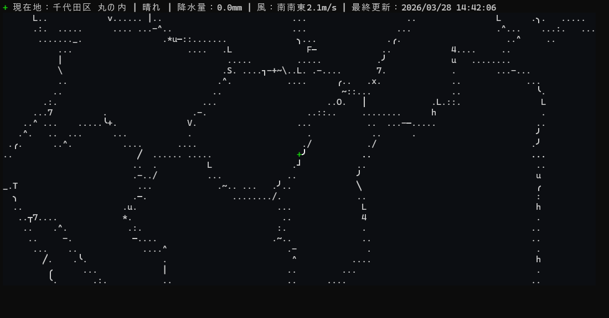

# ASCII Map Renderer



`ascii_map_renderer.py` renders the prefecture, city, and ward boundaries that intersect the visible map range, with the prefecture line brightest, the city line medium, and the ward line dimmest, over a muted JMA rain-radar background. The default center is Tokyo.

## Run

```powershell
pip install -r requirements.txt
python .\ascii_map_renderer.py
```

`python .\ascii_map_renderer.py --help` shows the CLI help without starting a render.

## Options

- `--lat N`: map center latitude, default Tokyo
- `--lon N`: map center longitude, default Tokyo
- `--marker-lat N`: marker latitude, default Tokyo
- `--marker-lon N`: marker longitude, default Tokyo
- `--cols N`: map width in characters
- `--rows N`: map height in characters
- `--scale M`: meters per character cell, default `150`
- `--cell-aspect R`: terminal cell height/width ratio, default `2.0`
- `--auto-cell-aspect`: detect the terminal cell height/width ratio instead of using the fixed default
- `--refresh-seconds N`: redraw interval for the rain radar background, default `300`
- `--once`: render once and exit
- `--no-color`: disable ANSI colors

## Notes

- The script fetches boundary GeoJSON from OpenStreetMap Nominatim on first run.
- The script fetches only administrative boundary geometries with `admin_level` 4, 7, or 8 from the OpenStreetMap Overpass API for the current viewport.
- The script fetches JMA nowcast `hrpns` radar tiles and uses them as the background color field, dimmed slightly so the boundary strokes remain visible.
- Radar data is kept in memory for the lifetime of the process and refreshed periodically; it is not written to disk.
- The static map layers are built once per process and reused across radar refreshes.
- The top status line is rendered in Japanese as `+ 現在地：{Prefecture} {City} {Ward} | {天気} | 降水量：{降水量} | 風：{風向}{風速（m/s）} | 最終更新：{日時}`.
- Downloaded boundary data is cached in `cache/` next to the script.
- Boundary strokes are chosen by bitmap similarity against a monospace font atlas, so the renderer can pick from box drawing, punctuation, digits, and letters when that better matches the local boundary shape.
- The implementation uses a WGS84 ECEF/ENU local projection for coordinate placement, so the marker and boundaries share the same precise map space.
- Terminal cell aspect is applied to the geographic projection and the glyph raster height together, so the visible map stays proportioned correctly on tall terminal cells.
- The default cell aspect is fixed at `2.0` because automatic detection is environment-dependent; use `--auto-cell-aspect` only if you want to try detection.
- The implementation uses `Pillow` and `numpy` rather than a dedicated terminal canvas library because the goal here is glyph-shape matching, not just generic block rendering.
- A green `+` marker is placed at the configured marker point, which defaults to Tokyo.
